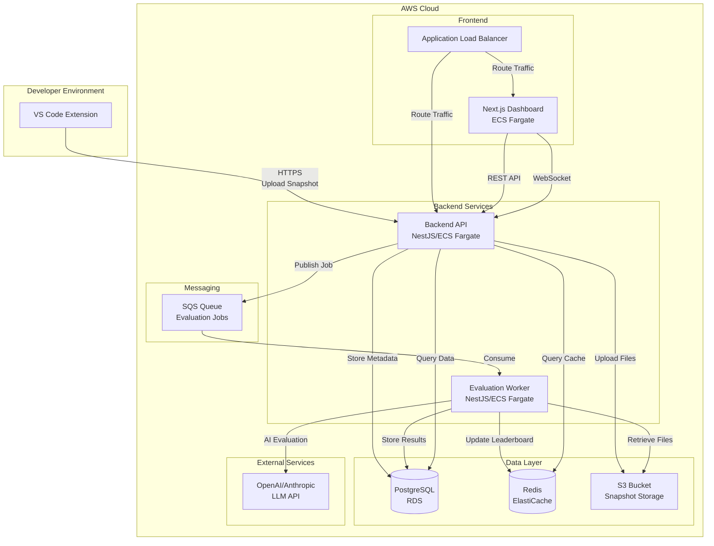
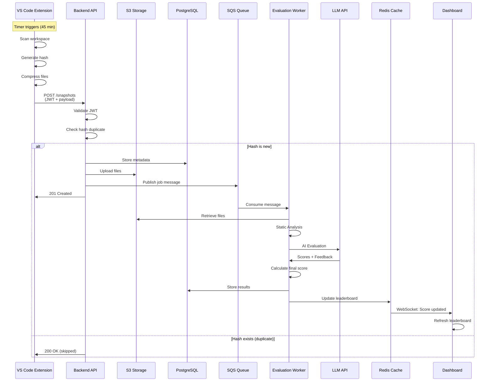
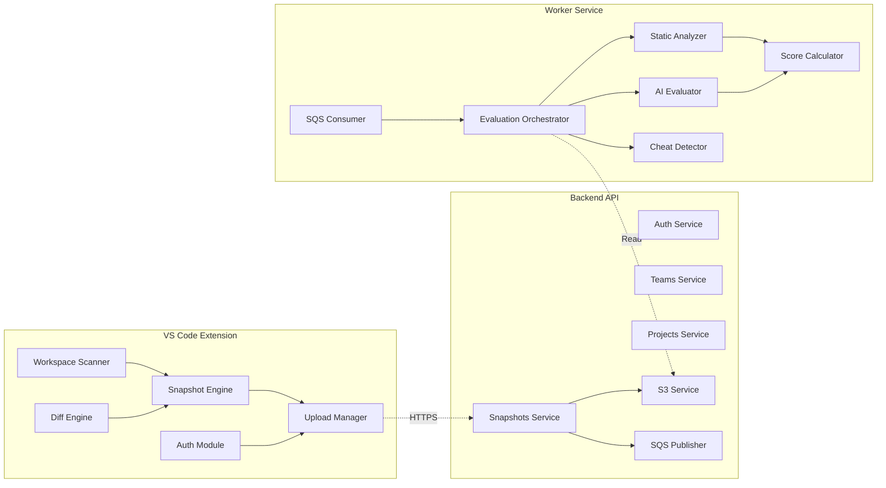
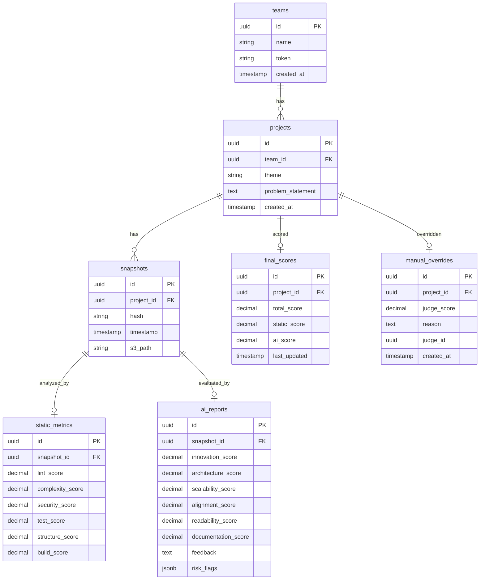
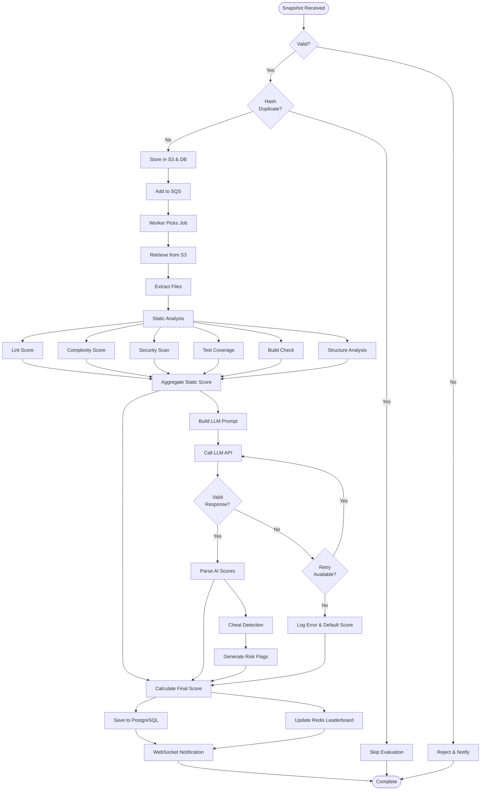
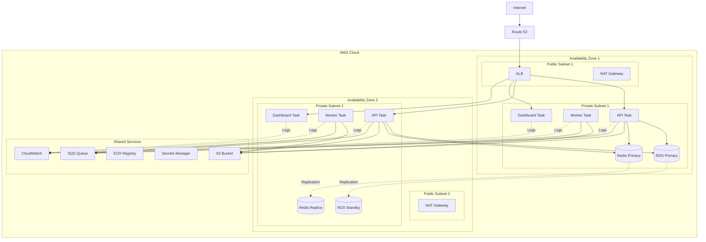
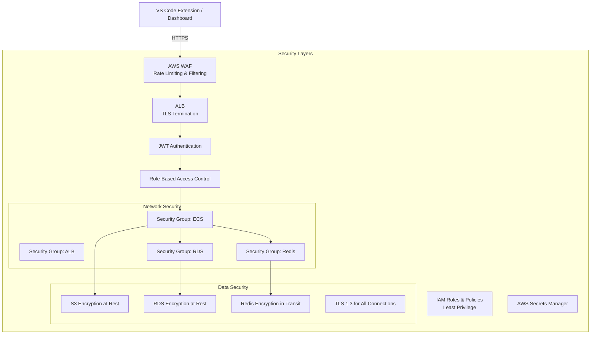
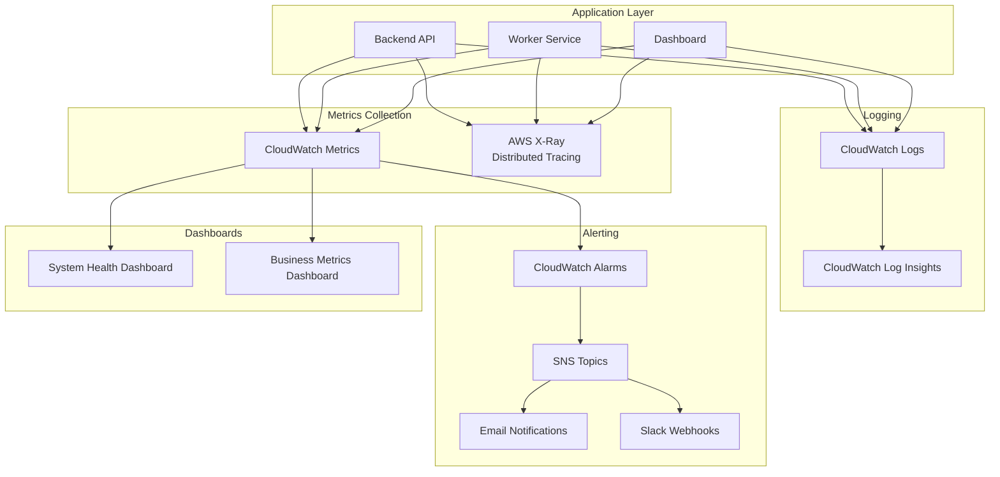

# 🎨 System Architecture Diagrams

This document contains visual architecture diagrams for VisionX Eval.

## 📊 High-Level System Architecture



## 🔄 Data Flow - Snapshot Submission



## 🏗️ Component Architecture



## 📦 Database Schema



## 🔀 Evaluation Pipeline



## 🌐 Deployment Architecture (AWS)



## 🔐 Security Architecture



## 📈 Monitoring & Observability



---

## 🎨 How to View These Diagrams

### In VS Code
Install the **Mermaid Preview** extension:
```
ext install bierner.markdown-mermaid
```

### In GitHub
Mermaid diagrams render automatically in markdown files.

### Online
Copy any diagram and paste into [Mermaid Live Editor](https://mermaid.live/)

---

**For more details, see:**
- [ARCHITECTURE.md](./ARCHITECTURE.md) - Detailed architecture
- [DEVELOPMENT_PHASES.md](./DEVELOPMENT_PHASES.md) - Implementation roadmap
- [PROJECT_SUMMARY.md](./PROJECT_SUMMARY.md) - Quick overview
